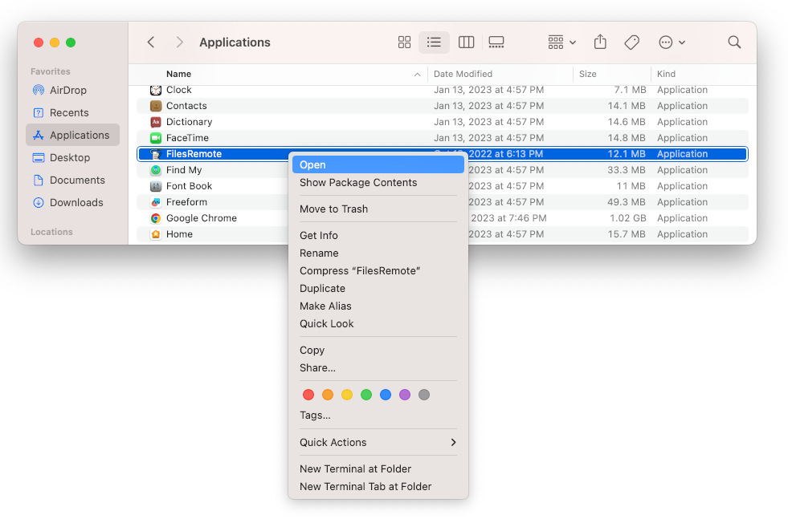

FilesRemote
===========

[Download](https://github.com/allanrbo/filesremote/releases/)

[](https://github.com/allanrbo/filesremote/releases/)

---

An SSH file manager.

 * Edit files like local:
   * Automatically download and open files in any local editor (configurable).
   * Automatically upload when changes are detected.
   * Especially useful on slow and unstable links, where FUSE+SSHFS would cause too big of a slowdown on the local system.
 * Edit files as root via sudo.
 * Uses SSH auth agent or public key auth when available, with fallback to password based authentication.
 * Cross platform.

This demo illustrates the automatic upload feature:


macOS:


Windows:


Linux:


Usage
-----

Command line usage:
```
Usage: filesremote [-h] [-i <str>] [-pw <str>] [[username@]host[:port]]
  -h, --help                    displays help
  -i, --identity-file=<str>     selects a file from which the identity (private key) for public key authentication is read
  -pw, --password=<str>         password to use for authentication and sudo (WARNING: Insecure! Will appear in your shell history!)
Example: filesremote example.com
Example: filesremote 192.168.1.60
Example: filesremote user1@192.168.1.60:2222
Example: filesremote 2001:db8::1
Example: filesremote [2001:db8::1]
Example: filesremote [2001:db8::1]:2222
```

Defaults to your local username and port 22 if unspecified.

### MacOS specific

On first run the app will be blocked, because I do not have an Apple Developer account. From MacOS version 13, it seems that the way to unblock it is to right click and click Open in from Applications:



On MacOS versions prior to 13, unblock it in this System Preferences pages:


After starting the app, go to File -> Preferences and set up the path of your text editor. For example for Sublime Text on MacOS this could be:

    open -a "Sublime Text"

Optionally make aliases for easy command line usage:

    alias filesremote="open -a FilesRemote --args $@"
    alias filesremote_myserver="filesremote user1@192.168.1.60"
